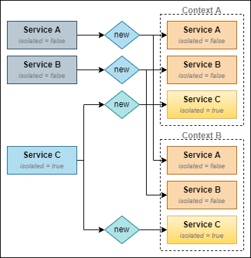

========================

Byteshift Injector is a tiny Dependency Injection library designed to
be used with TypeScript. It utilizes the reflect-metadata package to determine
the dependencies that a class needs.

[](https://opensource.org/licenses/MIT)    

## Features

 - Context isolation
 - Configuration via a single decorator 
 - Asynchronous auto-loading
 - Asynchronous factories
 - (Very) easy to use and integrate

## Getting started

Install using npm or yarn:

```shell
$ npm i @byteshift/injector --save
```

### Registering a service

A class is registered as a service using the `@Service()` decorator. A decorated
class is marked as a "shared service" that doesn't automatically load by
default.

```ts
import {Service, ServiceContainer} from '@byteshift/injector';

@Service()
class MyService
{
    public someNumber: number = 42;
}
```

A decorated class can be fetched from the service container using the `get`
method like so, which will retrieve an instance from the "global context".

```ts
const instance = await ServiceContainer.get(MyService);

// Prints 42.
console.log(instance.someNumber);
```

The `get()` method of the `ServiceContainer` or a container context returns a
promise to allow asynchronous service compilation for classes that implement
either `IAsyncService`, or a method called `initialize` that returns a
`Promise<void>`. See below for more information.

## Context Isolation

Isolated contexts are separate containers that can be created on-the-fly for a
specific context. Imagine having an HTTP server in which you want a separate
service container with isolated services that are instantiated for a specific
incoming `request`.

The `@Service` decorator supports an option `{isolated: true}`, which will
ensure that the service is instantiated anew when a new context of the service
container is being created, using the `ServiceContainer.of()` method.

Services which have `isolated` set to false (default) will have their existing
instances automatically available in the newly created context. This allows you
to have a mix of shared and isolated services for any specific context.



As illustrated above, "Service A" and "Service B" both use the _same instance_
in both contexts. "Service C" will be instantiated anew for every created
context. Meaning:

 - `Context A.Service A === Context B.Service A`
 - `Context A.Service B === Context B.Service B`
 - `Context A.Service C !== Context B.Service C`


The `ServiceContainer.of()` method accepts an arbitrary argument that identifies
the new context. This context argument can be _anything_.

Let's start by creating both a shared and an isolated service:
```ts
@Service()
class Database
{
    // This is a shared service.
    // Its instance remains the same across different contexts.
}

@Service({isolated: true})
class AppController
{
    // This is an isolated service. Its instance is fresh across every context. 
    
    constructor(private readonly db: Database)
    {
    }

    // This method is OPTIONAL. If it exists, it'll be invoked during container
    // compilation if {autoload} is set to true, or when the service is fetched
    // from the container for the first time.
    public initialize(req: Request): Promise<void>
    {
        // {req} is the CONTEXT of the container, passed to ServiceContainer.of()
    }

    public indexAction(req: Request): any
    {
        // It is safe to assign properties to this class, since its context is
        // based on the incoming request (see below).
        this.request = req;
    }
}
```

Imagine having an HTTP service in which the above class acts as a controller.

```ts
// Somewhere in your HTTP server...

http.on('request', async (req: Request, res: Response) => {
    
    // Create a service container based on the incoming request...
    const container = await ServiceContainer.of(req).compile();
    
    // Grab the controller.
    container.get(AppController).indexAction(req);
});
```

### Disposing a context

When you're done with a previously created context, call `dispose()` to clean up
any isolated service instances that were created for this specific context.

When `dispose()` is called, an optional `dispose`-method is called on service
classes, if it exists. This may be used in case a service requires to do some
cleaning-up.

### Using a factory to instantiate a service

Instead of letting the framework instantiate a class, factories can be used to
instantiate one as well, even asynchronously.

This can be useful, especially in context isolation in case you want a service
to be instantiated based on the given context.

```ts
import {AnyConstructor, FactoryOptions} from '@byteshift/injector';

@Service({
    isolated: true,

    /**
     * @param {new (...args: any[]) => any}           ctor
     * @param {{dependencies: any[], contextId: any}} options
     * @returns {Promise<any>}
     */
    factory:  async (ctor: AnyConstructor, options: FactoryOptions) => {
        // ... do stuff.
        const userData = await fetch('https://some.site?q=' + options.contextId);
        
        return new ctor(userData, ...options.dependencies);
    }
})
export class MyAwesomeService
{
    constructor(
        private readonly userData: any, // <-- Injected via factory.
        private readonly serviceA: ServiceA,
        private readonly serviceB: ServiceB
    ) {}
}
```

An error is usually thrown when a class constructor references a type that does
not exist in the service container. However, when a factory function is
specified, this validation method is skipped to allow custom data being injected
instead.

Going with the example above, context creation could look like this:
```ts
// Invokes fetch on https://some.site?id=12345 and passes the response object to
// the constructor of MyAwesomeService before returning it.
const instance = await ServiceContainer.of(12345).get(MyAwesomeService);
```
